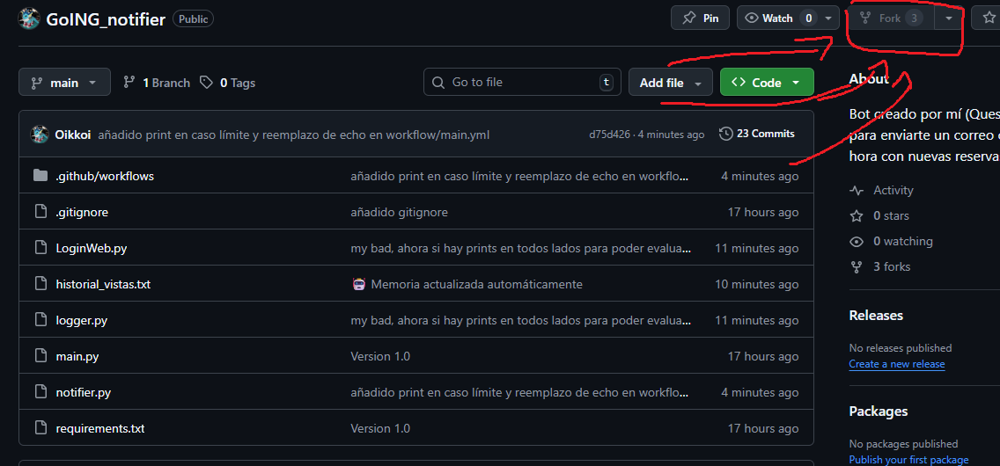
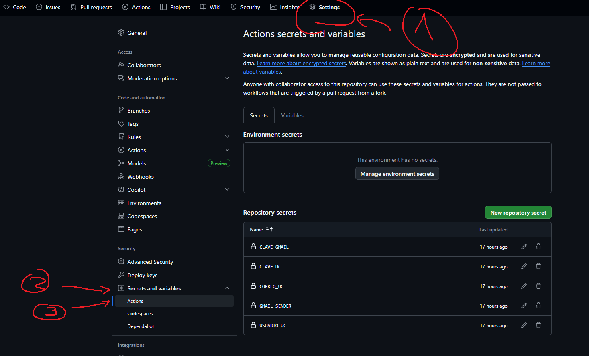
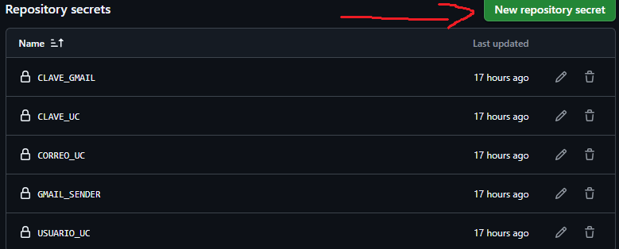
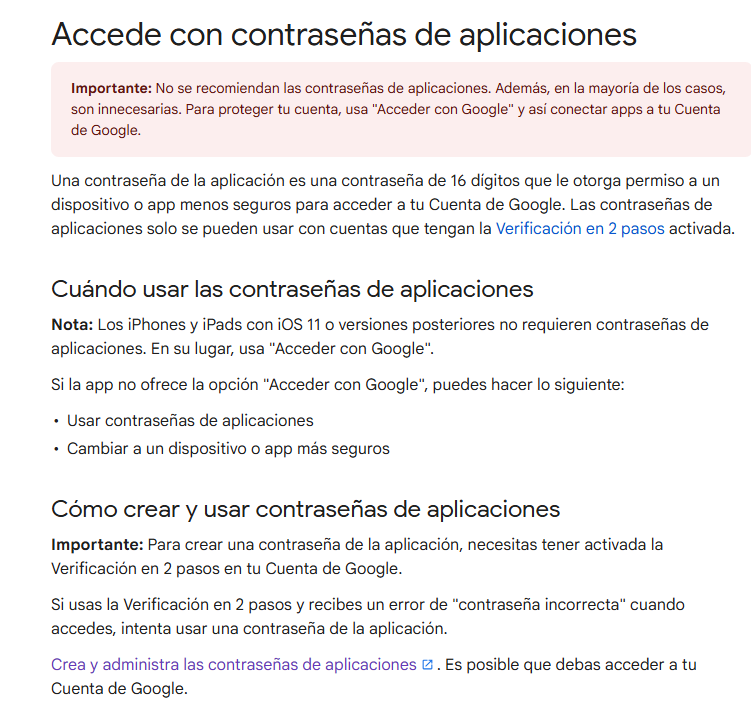
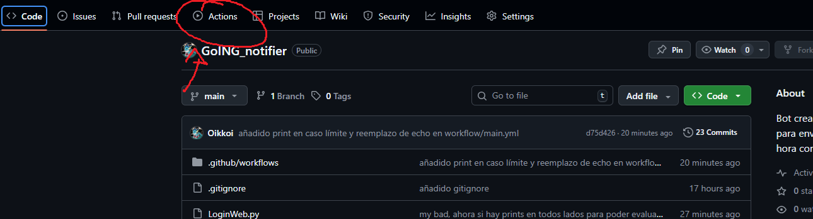
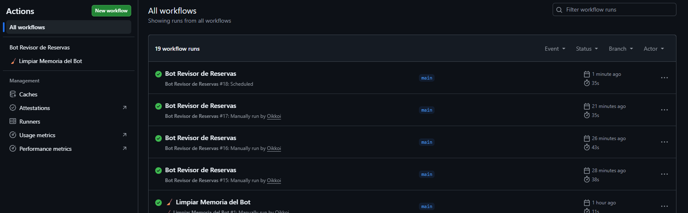
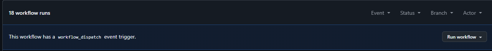

# Gracias Gemini por ayudarme con la librería de selenium. No era muy difícil pero no quería leer eso.

Dicho eso, soy Queso, tutor y (desde este semestrel) miembro del GOing. Y como ustedes, tengo el mismo problema de no saber cuándo me llegaron reservas nuevas. Para eso existe este bot de automatización.

## Configurando el bot:
Para tener el tuyo, creas un fork en donde se indica en la imagen a continuación:

Lo que creará una versión del repositorio del mío en tu cuenta de GitHub. Después de eso, te diriges a Settings -> Secrets and variables -> Actions, lo que te dejaría en esta ventana:

A diferencia de mi, tu fork debería tener la sección "Repository secrets" en blanco. El código funciona a base de acceder a estos secrets (en `main.yml` está el detalle, si quieres ver como se utiliza), que serán las credenciales y contraseñas de acceso. Para crear un secreto nuevo, debes ir a este botón y crear los cinco secretos, cada uno con **EXACTAMENTE** el mismo nombre a los que salen en la foto: 

1. USUARIO_UC: cuando entras a canvas y te pide usuario y contraseña? Ese usuario
2. CORREO_UC: tu correo al que quieres que te llegue el aviso. En teoría, no tiene por qué ser de la UC, pero lo recomiendo por preferencias personales.
3. GMAIL_SENDER: El correo DESDE el que se enviarán los correos de aviso a CORREO_UC
4. CLAVE_UC: la clave que pones cuando entras a canvas

### 5. CLAVE_GMAIL:
Tengo que hacer una pausa con esto. Tienes que entrar en este enlace: https://support.google.com/mail/answer/185833?hl=es-419. Para que el bot funcione, tu correo (el de GMAIL_SENDER) debe tener la configuración de seguridad 2AF (Verificación en dos pasos) activada. 

Ahí, tienes que entrar al enlace! marcado en morado:

Google te pedirá entrar con tu correo y contraseña, recuerda que debes ingresar con GMAIL_SENDER. Una vez dentro, te pedirá nombrar la app password (yo le puse "bot going"). Es una clave única para una aplicación, en papel es una forma de acceso para que no tengan acceso a tu contraseña real, y en cuanto la borres en la misma página pierde toda utilidad y ya no pueden acceder a tu cuenta con ese código.

Entonces, creas la contraseña y copias los 16 caracteres tal como saldrán en la ventana emergente. Ese es el contenido del secreto CLAVE_GMAIL.

## Activando el bot:
Lo primero será abrir el panel "Actions" en la barra superior:

Entonces saldrá un pequeño menú diciendo que no se permiten las actions a los forks, pero tu le apretarás al botón verde que dice que lo activen igual.

Entonces verás esta ventana de aquí (sin los logs):

Entonces irás a "Bot revisor de reservas", te pedirá activar el worflow. Cuando lo hagas el título cambiará a esto:

Y entonces darás click donde dice "Run worflow" (el menú desplegable) y luego de nuevo, el botón verde que también dice "Run worflow" que estaba dentro del menú. Si todo está bien configurado y no he roto el bot en alguna actualización, debería ejecutarse (se pondrá en amarillo mientras se ejecuta) y entonces aparecerá un log con un ✅. Si sale en rojo en vez de verde, escríbeme.